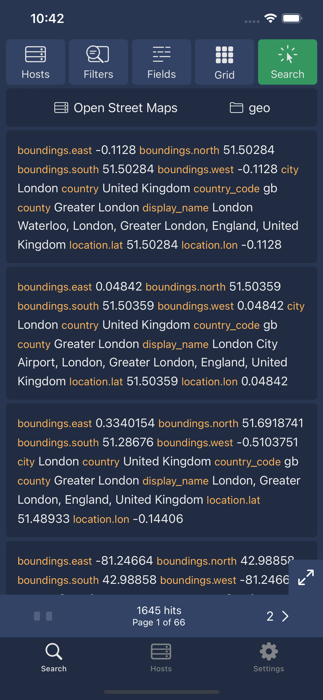
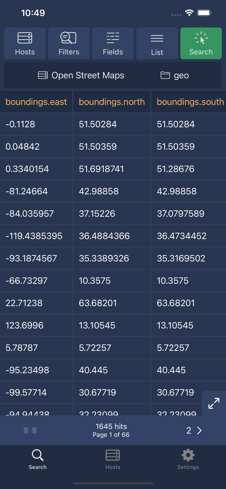
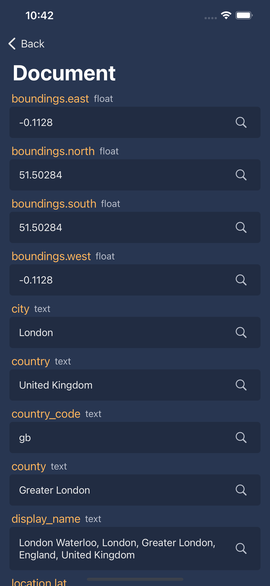

# SearchOps

**SearchOps is now completely Open Source!** 🎉

This repository contains the complete open-source iOS and macOS applications for SearchOps. The entire application source code is available on GitHub, including all UI components, business logic, and features for authenticating and querying ElasticSearch & OpenSearch instances.

I'm sharing Search Ops with a **Convenience Pricing Model** - the complete source code is freely available here, providing transparency, with pre-built versions are available on the App Store for those who prefer the convenience of automatic updates and easy installation. 

> If you get value, I appreciate purchasing via the Apple App Store, which supports further development of the application and gets you automated updates. If you can't purchase right now, feel free to download and compile directly from source from here straight on to your device (iPhone/iPad or macOS). I'm an independent developer building software that I find useful. If you have any feedback or suggestions do send me a message. Thanks for dropping by!   ***@mccaffers (Ryan McCaffery)***

## Development

    

## Supports

- ElasticSearch version 6.0 and above
- Opensearch version 1.0 and above

## Apple App Store

Available on the Apple App Store for iOS and macOS platforms

## Screenshots

 

## Features

Query ElasticSearch and OpenSearch clusters
* Free text strings, using compounds (AND/OR) and date ranges 
* View results as documents or in a table
* Easily switch between hosts, indexes and filter on mapped data types

Support ElasticSearch (v5.0 and above) and OpenSearch (v1.0 and above)
* /_mapping
* /_search
* /_aliases

Authentication:
* Connection using a CloudID from Elastic.co or a direct host connection
* Authenticate with Username/Password, Auth Token, API Token or API Key
* Readonly access only. Requires a user with Viewer and Monitoring User

Privacy & Transparency:
* Fully Open Source - complete application source code on GitHub
* No tracking or analytics
* Uses a local on device database (Realm) with encryption on

Local Database
* This package utilities a local Realm Database (https://github.com/realm/realm-swift). By default, this packages enables encryption and disabled metrics.

Testing
* Swift testing with various responses `./Tests/Resources`
* On build tests with Github Actions with Sonarcloud analysis
